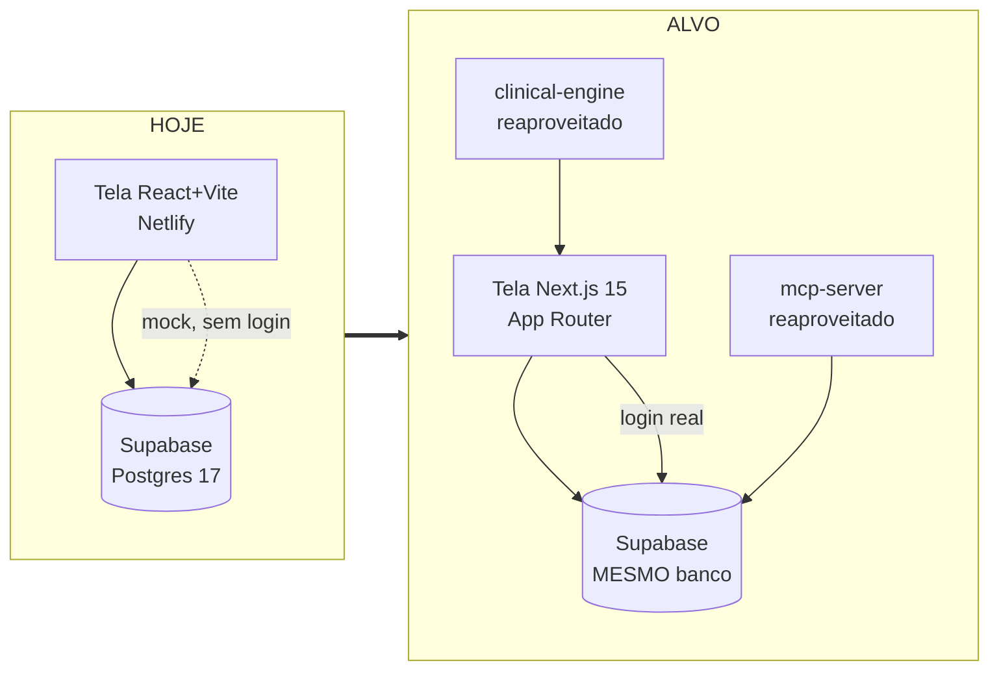
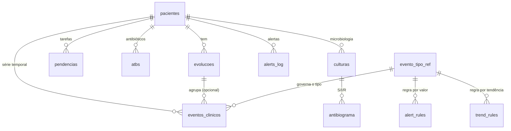
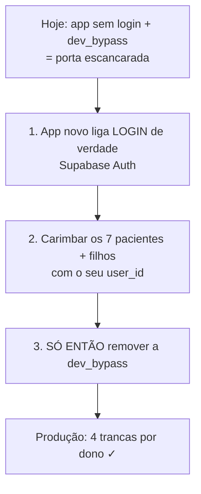

# SASI v3 — Plano de Migração e Modelo de Dados
### Do "banco vivo" para a versão que funciona de verdade

> **Autor da análise:** sessão Cowork (Claude) · **Data:** 30/07/2026
> **Para:** Dr. Nicolas Nagaita (Tenente) — Comando UTI Alpha
> **Escopo desta rodada:** **modelo de dados primeiro** (o alicerce). Views, OCR e FHIR entram nas rodadas seguintes — mas já ficam mapeados aqui.

---

## Como ler este documento

Este é o **plano** — o mapa da obra, não a obra. O código pronto (SQL e tipos) está nos **anexos**, para você entregar ao Claude Code / seu editor aplicar. Seguindo a Diretriz nº 0 do seu próprio `CLAUDE.md`, **todo termo técnico vem traduzido em 1 linha na primeira vez que aparece**, com uma analogia clínica sempre que ajudar. Nada de "é só rodar X".

Glossário-relâmpago dos termos que mais aparecem:

| Termo | Tradução de 1 linha (analogia) |
|---|---|
| **Schema (do banco)** | A planta da ficha: quais campos existem, de que tipo, e as regras de preenchimento. É o "molde SASI", só que dentro do banco. |
| **Migração (migration)** | Uma "ordem de serviço" versionada que altera a planta do banco — como uma correção de protocolo assinada e datada. |
| **RLS (Row Level Security)** | Tranca por linha: cada registro só é visto/mexido pelo seu dono. Sigilo médico embutido no banco. |
| **Enum** | Lista suspensa fixa: o campo só aceita valores de uma lista fechada (ex.: gravidade ∈ {estável…óbito}). |
| **Constraint (restrição)** | Regra de segurança do banco: recusa dado impossível (altura 10 cm, leito repetido). O banco "grita, não conserta". |
| **Index (índice)** | O "índice remissivo" do banco: acha o dado rápido sem ler tudo. |
| **Trigger (gatilho)** | Reflexo automático do banco: ao gravar X, ele faz Y sozinho (ex.: recalcular o semáforo de gravidade). |
| **FK (chave estrangeira)** | Amarra um registro a outro (evento → paciente), impedindo "órfãos". |
| **JSONB** | Uma "caixa flexível" dentro de uma coluna, guarda uma ficha estruturada sem coluna fixa pra cada campo. |
| **FHIR** | A "tomada padrão" mundial de dados de saúde — o formato que EHR/hospitais entendem. |

---

## 0. Resumo executivo (numa página)

**O que é o SASI hoje.** Um sistema de plantão **real e em produção**: um aplicativo web (React/Vite, no Netlify) sobre um banco de dados online (Supabase/PostgreSQL 17) que já roda com pacientes de verdade — 7 leitos ativos na UTI2, 76 medições em série temporal, um motor de alertas por gatilho, e ingestão de dados por foto/PDF via Claude. O banco é sofisticado e bem pensado; o problema não é falta de coisa, é **falta de formalização e de fundação para escalar** (autenticação real, segurança de produção, contrato de dados estável).

**O que trava a "versão que funciona de verdade".** Sete dívidas conhecidas — a maior é a `dev_bypass`, uma "porta escancarada" de segurança que foi aceita de propósito para o uso solo sem login, mas que **impede** migrar para um app de verdade com autenticação.

**O plano, em uma frase.** Formalizar o modelo de dados agora (esta rodada, **já pronta e testada** — Anexos A/B/C), e depois trocar o "motor" do frontend para o template **Next.js 15** consumindo o mesmo banco, ligando login de verdade e removendo a porta escancarada **na ordem certa** para não travar o app que já roda.

**A régua de fases:**

```
F0  Modelo de dados          ← ESTA RODADA (SQL validado ✓)
F1  Scaffold Next.js 15 + tipos
F2  Views (Dashboard/War Room) lendo o banco
F3  Login real + remover dev_bypass  (ORDEM É CRÍTICA)
F4  OCR da folha de enfermagem (o propósito do projeto Cowork)
F5  Camada FHIR (interoperabilidade)
```

**As 5 decisões de modelo de dados desta rodada** (todas justificadas na §3, todas validadas em Postgres):

1. **Enums nativos** para vocabulários fechados (unifica o descompasso "o enum existe mas a coluna é texto solto" que encontrei no banco vivo).
2. **`evento_tipo_ref`** — uma tabela-legenda que governa os 56 tipos de medição (com unidade padrão, faixa de absurdo fisiológico da sua doutrina e um espaço para o código LOINC do FHIR).
3. **RLS de produção** — 4 trancas por comando (ler/inserir/editar/apagar), conforme a **sua própria regra** em `.claude/rules/supabase.md`, no lugar da `dev_bypass`.
4. **`memorias` com dono** — o baú de memória (busca semântica) hoje tem tranca ligada mas nenhuma regra; ganha dono.
5. **Extensões fora do `public`** — organização/segurança recomendada pelo Supabase.

---

## 1. Diagnóstico — onde o SASI está hoje

### 1.1 A stack real (traduzida)

Levantei isto lendo o seu Supabase vivo **e** o repositório `doutortenente/SASI` no GitHub (só leitura — não toquei em nada).

| Camada | Tecnologia (o que é, em 1 linha) | Onde vive |
|---|---|---|
| **Aplicativo (frontend)** | React 18 + Vite — o "motor" atual da tela. Vite = a ferramenta que monta o site. | `frontend/`, publicado no **Netlify** (`sasi-uti.netlify.app`) |
| **Banco de dados** | Supabase = PostgreSQL 17 + login + tempo real + funções. É a **única fonte de dados**. | Projeto `idswehsvvqczzkiatuzu` (São Paulo) |
| **Ponte de ingestão** | Claude lê foto/PDF → gera um JSON validado → grava no banco (via "MCP" = a ponte, ou pela tela). | `mcp-server/` + skill `sasi-ingest-export` |
| **Motor clínico** | Um pacotinho de código com as contas (SOFA, conversões pt-BR), com testes. | `packages/clinical-engine/` |
| **Funções de borda** | Pequenos programas que rodam junto ao banco (ex.: `ocr-ingest`). | `supabase/functions/` (hoje legado) |

**Traduzindo o essencial:** hoje a tela é feita com uma ferramenta (Vite); a migração troca essa ferramenta pelo **Next.js 15** (mais moderno, com "renderização no servidor" — as telas chegam prontas, mais rápidas e seguras). **O banco não muda de casa** — ele continua no Supabase. Por isso faz todo sentido arrumar o banco primeiro.

### 1.2 O banco vivo (o que realmente existe)

Muito mais rico do que o molde sugeria. Estado real hoje:

| Tabela | O que guarda | Linhas |
|---|---|---:|
| `pacientes` | Cadastro + status do leito + semáforo de gravidade + dispositivos + resumo (Patient Summary) | 7 |
| `evolucoes` | 1 retrato do plantão por paciente: 7 sistemas em "caixa flexível" (JSONB) + SOFA + impressão/conduta | 7 |
| `eventos_clinicos` | **Série temporal** — 1 linha por medição. É o coração das tendências e dos alertas. | 76 |
| `pendencias` | Tarefas/follow-up | 21 |
| `atbs` / `culturas` / `antibiograma` | Antibióticos (stewardship) + microbiologia + antibiograma S/I/R | 0 |
| `alerts_log` | Alertas disparados (com anti-repetição por "impressão digital" SHA-256) | 5 |
| `ingest_audit_log` | Auditoria de cada ingestão (rastro obrigatório — ZERO ALUCINAÇÃO) | 8 |
| `memorias` | Baú de memória para busca semântica (RAG, vetores 768) | 0 |
| `alert_rules` / `trend_rules` | Configuração do motor de alertas (por valor e por tendência) | 25 / 3 |

Mais **7 views** (consultas prontas — "relatórios salvos": `vw_dashboard_uti`, `vw_sofa_diario`, `vw_bh_acumulado`, `vw_dias_atb_ativo`, `vw_alertas_abertos`, `vw_eventos_pendentes_revisao`, `vw_eventos_tendencia`), **9 gatilhos** e o RPC atômico **`save_ficha`** (grava a ficha inteira "tudo ou nada").

Observação de campo importante: **100% dos 76 eventos vieram por `claude_ocr`** — ou seja, a ingestão por foto já é, na prática, o fluxo principal. Isso reforça a prioridade do pipeline de OCR (F4).

### 1.3 As dívidas que travam a "versão de verdade"

Estas não são críticas minhas — são dívidas que o **próprio projeto** já reconhece (STATUS.md, MEMORY.md) ou que os "consultores automáticos" do Supabase (advisors) apontaram. Traduzidas:

1. **`dev_bypass` — a porta escancarada.** Existe uma regra de segurança em **todas** as tabelas que diz "pode tudo, pra todo mundo" (`USING(true)`). Foi aceita de propósito para o uso solo sem login. Ela sozinha gera **1 alerta de segurança + ~180 alertas de desempenho** (porque cada tabela fica com 2 regras concorrentes). E **contraria a sua própria regra** (`.claude/rules/supabase.md`: "Proibido `USING(true)` em produção — é o bug `dev_bypass`"). É o maior bloqueio para virar app de verdade.
2. **Enum que existe mas não é usado.** O banco tem os tipos `gravidade_enum` e `status_leito_enum` criados, mas as colunas guardam **texto solto** com uma regra à parte. Duas fontes da verdade para a mesma coisa — pediria pra divergir.
3. **Vocabulário de eventos "chumbado" numa regra de 56 valores.** O tipo de cada medição é uma lista fixa dentro de uma constraint. Some/renomeie um e é preciso reescrever a regra inteira. Difícil de manter e sem espaço para o código LOINC (FHIR).
4. **"2 esquemas" dentro do JSONB da evolução.** A ficha grava com um conjunto de nomes (`pas1/pas2`) e o resto do app lê outro (`pa_sys_max/min`); hoje há um adaptador (`fichaSchema.ts`) costurando os dois. Funciona, mas é frágil.
5. **SOFA bloqueado por dado.** 0 de N evoluções têm os 6 componentes (bilirrubina e PaO₂/FiO₂ nunca capturadas). O cálculo fica `null` — corretíssimo pela doutrina ZERO ALUCINAÇÃO, mas o conserto é **a montante** (a skill capturar os componentes), não no banco.
6. **Extensões no lugar errado.** `pg_trgm` e `vector` estão no schema `public`; o Supabase recomenda isolá-las em `extensions`.
7. **`memorias` com tranca sem regra.** RLS ligado, zero policy — hoje só a `dev_bypass` deixa acessar. Ao remover a porta escancarada, o baú fica inacessível se não ganhar uma regra própria.

> **A leitura estratégica:** o SASI não precisa ser reconstruído. Ele precisa ser **formalizado e endurecido** — transformar convenções implícitas (que hoje vivem na cabeça e no código) em **regras explícitas dentro do banco**. É exatamente o que "modelo de dados primeiro" entrega.

---

## 2. Para onde vamos — arquitetura-alvo

### 2.1 O template Next.js 15 (traduzido)

O template que você escolheu troca o "motor" da tela por **Next.js 15 (App Router)**. Em linguagem clínica:

- **App Router** = o novo jeito do Next.js organizar as telas por pastas (`app/beds`, `app/patients`…). Cada pasta é uma tela, com sua própria "porta de dados".
- **Server Components** = a tela é montada **no servidor** e chega pronta ao navegador (mais rápida, e a chave de acesso ao banco não fica exposta no navegador — importante para dado clínico).
- **Zustand** = uma "prancheta de plantão" em memória: guarda o estado da tela (leito selecionado, filtros) sem recarregar.
- **shadcn/ui + Tailwind** = a caixa de peças de interface + o sistema de estilos (já é o que você usa; mantém os 2 temas Tactical/Clinical).

**O que muda e o que fica:**



**Fica de pé (reaproveitado):** o banco Supabase inteiro, o `clinical-engine` (as contas de SOFA), o `mcp-server` (a ponte de ingestão), os 2 temas visuais. **Troca:** só o "motor" da tela (Vite → Next.js) e liga-se o login de verdade.

### 2.2 Por que o modelo de dados vem primeiro

O banco é a fonte única da verdade e **não vai mudar de casa**. Se a fundação (tipos, trancas, contratos) estiver formalizada, o app novo nasce lendo tipos gerados automaticamente e regras já garantidas pelo banco — menos bug, menos retrabalho. Arrumar a tela antes do alicerce seria pintar a parede antes de assentar o tijolo.

---

## 3. O modelo de dados (o coração desta rodada)

### 3.1 Visão geral (o mapa das tabelas)



Cada tabela, em 1 linha:

- **`pacientes`** — o leito e quem o ocupa: cadastro, status, semáforo de gravidade, dispositivos, e a "ficha congelada" (Patient Summary).
- **`evolucoes`** — 1 retrato do plantão: os 7 sistemas em caixa flexível, DVA/sedativos, impressão↔conduta (1:1), riscos, prescrição.
- **`eventos_clinicos`** — a série temporal: 1 linha por medição, com fonte, confiança e "precisa revisar?". É o que alimenta tendências, SOFA e alertas.
- **`evento_tipo_ref`** (novo) — a **legenda** dos tipos de medição.
- **`atbs` / `culturas` / `antibiograma`** — stewardship de antibiótico + microbiologia.
- **`pendencias`** — tarefas por paciente.
- **`alerts_log` + `alert_rules`/`trend_rules`** — o motor de alertas e sua configuração.
- **`ingest_audit_log`** — o rastro obrigatório de cada ingestão.
- **`memorias`** — o baú de busca semântica (RAG).

### 3.2 As 5 decisões de formalização (problema → decisão → porquê)

**Decisão 1 — Enums nativos para vocabulário fechado.**
*Problema:* colunas como `uti`, `gravidade`, `plantao` guardam texto solto com uma regra à parte; e os enums `gravidade_enum`/`status_leito_enum` existem mas não são usados (duas fontes da verdade).
*Decisão:* transformar em **enum nativo** (lista suspensa fixa dentro do banco): `uti_enum`, `gravidade_enum`, `status_leito_enum`, `isolamento_enum`, `severidade_visual_enum`, `plantao_enum`, `via_atb_enum`, `intencao_atb_enum`, `material_cultura_enum`, `antibiograma_resultado_enum`, `severidade_alerta_enum`, `fonte_evento_enum`, `comparador_enum`, `trend_modo_enum`.
*Porquê:* uma fonte da verdade, erro impossível de digitar, e os tipos aparecem automaticamente no TypeScript do app (a tela "sabe" as opções). **Ressalva:** trocar texto→enum no banco vivo exige checar antes se todo dado atual encaixa (ver §4 e Anexo B).

**Decisão 2 — `evento_tipo_ref`, a legenda que governa as medições.**
*Problema:* os 56 tipos de evento viviam "chumbados" numa regra; sem unidade padrão, sem faixa de absurdo, sem espaço para LOINC.
*Decisão:* criar uma **tabela-legenda** com uma linha por parâmetro, carregando: `unidade_padrao`, `faixa_min`/`faixa_max` (as **flags de absurdo fisiológico da sua doutrina** — PAS 50–260, FC 20–250, SpO₂ 50–100 etc.), e `loinc_code` (o slot FHIR). A coluna `eventos_clinicos.tipo` passa a **apontar** para essa legenda (FK).
*Porquê:* adicionar um parâmetro novo vira **inserir uma linha** (dado), não reescrever regra (código). A legenda vira a casa natural das faixas de plausibilidade e do mapa FHIR. E o motor de alertas ganha um lugar único para validar.

> **ZERO ALUCINAÇÃO respeitado:** preenchi `loinc_code` **somente** nos 5 sinais vitais verificados pela skill FHIR (FC, PAS, PAD, Temp, SpO₂). Os demais ficam `null` — a completar na fase 2 usando os servidores de terminologia que você já tem conectados (ICD-10, SNOMED). Nada de código "razoável" inventado. As faixas de absurdo vêm da sua doutrina (`_SASI_TEMPLATE_BASE_v2.md`), fonte legítima.

**Decisão 3 — RLS de produção: 4 trancas por comando.**
*Problema:* a `dev_bypass` deixa "tudo aberto".
*Decisão:* substituir por **4 regras separadas por tabela** (ler / inserir / editar / apagar), escopo "só o dono", exatamente como manda a sua regra `.claude/rules/supabase.md`. Para as tabelas-filhas (evolução, eventos…), a posse é verificada por uma função auxiliar `fn_owns_paciente()` que confere se o paciente é seu.
*Porquê:* sigilo médico garantido pelo banco, não pela tela. **Ordem importa** — ver §4.

**Decisão 4 — `memorias` com dono.**
*Problema:* tranca ligada, zero regra.
*Decisão:* adicionar `user_id` e 4 regras "só o dono". (Se quiser um baú compartilhado de protocolos no futuro, isso vira uma tabela separada, legível por todos — anotado.)

**Decisão 5 — Extensões fora do `public`.**
*Decisão:* mover `pg_trgm` e `vector` para o schema `extensions`. *Porquê:* recomendação do Supabase (organização e superfície de segurança menor).

### 3.3 Os contratos JSONB (o "recheio flexível")

Boa parte da riqueza clínica vive em caixas flexíveis (JSONB). Elas dão liberdade, mas **precisam de contrato documentado** — senão viram o problema dos "2 esquemas". Abaixo, os formatos **reais que encontrei no banco** (a documentar formalmente e, na fase 2, validar com Zod na borda / `pg_jsonschema`):

**`pacientes.dispositivos`** — `{iot, cvc, pai, svd, sne, avp, picc, tqt, dreno, mpd, shilley: booleano, detalhe: texto}`
**`pacientes.riscos_flags`** — `{pav, broncoaspiracao, upp, queda, diabetico: booleano}`
**`pacientes.patient_summary`** — a ficha congelada: `data_admissao, motivo_admissao, hpma, antecedentes, medicamentos_domiciliares[], alergias, dispositivos[], suporte_atual{dvas[], ventilacao, sedacao, antibioticos[]}, interconsultas[], programacao[], resumo_sistemas[], iatrogenias, sutilezas, dva_fluidos, exames_relevantes, plano_terapeutico_atual`
**`evolucoes` (sistemas)** — `hemo{pa_sys_max/min, pa_dia_max/min, pam_max/min, fc_max/min, ritmo, obs}`, `resp{suporte, fr_max/min, spo2_max/min, obs}`, `neuro{descricao, rass}`, `renal{cr, ur, diurese_6_18h_ml, bh_6_18h_ml, obs}`, `hemato{hb, ht, plaq, obs}`, `infecto{atb, tmax, leuco, obs}`, `tgi{dieta, obs}` — este é o **esquema canônico** (Máx–Mín) e deve ser a **única fonte da verdade**; a ficha adapta na entrada/saída.
**`evolucoes.dvas` / `sedativos`** — `[{droga, dose, unidade}]`
**`evolucoes.prescricao`** — por categoria: `{cardiovascular[], snc[], gastro_endocrino[], infeccioso_resp[], sintomaticos_sn[], solucoes_diureticos[], nutricao[]}`

*Recomendação (fase 2):* eleger o canônico Máx–Mín como fonte única e validar o JSON na borda (o app e a função de ingestão recusam formato fora do contrato), aposentando aos poucos o adaptador `fichaSchema.ts`.

### 3.4 O que **não** muda (de propósito)

Os gatilhos e a lógica do banco estão bons e permanecem: `updated_at` automático, auto-marcação de baixa confiança (`confidence<0.7 → requires_review`), motor de alerta/tendência com anti-repetição SHA-256, invalidação do cache de SOFA, semáforo de gravidade, e o `rls_auto_enable` (que já liga a tranca em toda tabela nova — ótima guarda de produção). O `save_ficha` ganha só um endurecimento: passa a carimbar o dono (`user_id`) para funcionar sob a segurança real.

> ⚠️ **Achado a corrigir (pequeno):** o gatilho do semáforo (`sync_severidade_visual`) só dispara em **update**, não em **insert**. Um paciente admitido já "grave" nasce com semáforo `green` até a primeira edição. Sugestão: ajustar para disparar também no insert (uma linha). Já incluído no Anexo B (passo A6).

### 3.5 O contrato de ingestão (`sasi-ocr-ingest/v1`) — como o dado entra

Confirmei no pacote de extração clínica que você enviou (`EXTRACAO-CLINICA-SASI`): **toda** entrada de dado — foto da folha de enfermagem, laudo de laboratório, gasometria, cultura, eco, texto livre — passa por **um único envelope** JSON (`sasi-ocr-ingest/v1`). Ele carrega: `source` (tipo + confiança + avisos), `target` (uti/leito/paciente), um `evolucao_snapshot` opcional (os 7 sistemas) e uma lista de `eventos_clinicos`. É o que o modelo de dados precisa aceitar — e aceita.

Dois pontos que o modelo já honra:

- **Eco e hemodinâmica calculada cabem sem inventar tipo novo.** Índice cardíaco, RVS, PSAP, VCI/colapsabilidade, ΔVpeak, FEVE, TAPSE etc. entram como `tipo='custom'` + `valor_json = {dominio:'ecocardiograma', subtipo:'indice_cardiaco', unidade, ...}`. É a "válvula de extensão" documentada no `evento_tipo_ref`. Ou seja: as features de hemodinâmica que você quer nas Views **não exigem mudança de banco** — só convenção de `valor_json` (já anotada).
- **Duas camadas de plausibilidade.** A malha de sanity-check tem dois níveis: *impossível* (ex.: SpO₂ > 100 → `physiological_error`) e *revisar* (ex.: FR > 60 → `review`). No banco, o `evento_tipo_ref.faixa_min/max` guarda o nível **impossível** (o "grito" duro); o nível *revisar*, mais fino, fica na skill de extração e no gatilho `requires_review` (confiança < 0,7). O princípio **ZERO ALUCINAÇÃO** manda: o sistema sinaliza, **não conserta** — o dado errado propaga com bandeira, nunca vira valor "melhorado".

**Consequência para o roadmap:** a fase de OCR (F4) já tem contrato definido e uma edge function (`ocr-ingest`) implementada — não é terreno novo, é consolidação. A tabela `ingest_audit_log` já garante o rastro obrigatório de cada ingestão.

---

## 4. Segurança e o `dev_bypass` — o passo a passo mais delicado

Este é o ponto onde "arrumar o banco" e "não quebrar o que já roda" se cruzam. **A ordem não é negociável:**



**Por que essa ordem?** As regras "só o dono" comparam com quem está logado. Hoje o app entra sem login (usuário "de mentira"), então "quem está logado" é *ninguém* — se eu remover a porta escancarada **antes** de ligar o login e carimbar os donos, as regras "só o dono" barram tudo e **o app trava** (o banco fica invisível). Por isso: liga login → carimba dono nos dados existentes → remove a `dev_bypass`.

O Anexo B traz o SQL de cada passo, incluindo o "carimbo" (`update pacientes set user_id = '<seu-uuid>' where user_id is null`, e o mesmo nas tabelas-filhas). **Recomendação de ouro:** rodar o Anexo B primeiro numa **cópia descartável** do banco (o Supabase tem "branch" = um clone de teste), conferir, e só então no vivo.

---

## 5. FHIR — a decisão e o mapa (fase futura)

**O que é e por que importa.** FHIR é a "tomada padrão" mundial de dados de saúde (Patient, Observation, Encounter…). Adotá-lo abre portas: exportar para prontuário hospitalar, integrar com EHR (Epic/Cerner), e falar a mesma língua de outros sistemas.

**Minha decisão (você delegou):** **camada de interoperabilidade/export**, **não** modelo nativo. Ou seja: o banco continua pragmático e rápido para a beira-leito (é o que salva tempo no plantão), e o FHIR é gerado **na borda** (por views/funções) quando precisar exportar. Modelo FHIR-nativo engessaria a digitação rápida sem ganho no uso solo de hoje. Nesta rodada o schema fica só **"FHIR-ready"** (o slot `loinc_code` na legenda, IDs estáveis, timestamps) — a camada em si é fase 5.

**O mapa (Anexo D, resumo):**

| Tabela SASI | Recurso FHIR R4 | Sistema de código |
|---|---|---|
| `pacientes` | **Patient** (+ **Encounter** para a internação) | — (identificador/MRN se houver) |
| `eventos_clinicos` (vitais/labs) | **Observation** (`category`: vital-signs / laboratory) | **LOINC** (`Observation.code`) |
| `evolucoes.problemas_ativos` / `hd` | **Condition** | **ICD-10** / SNOMED |
| `atbs` | **MedicationRequest** / **MedicationAdministration** | **RxNorm** |
| `culturas` + `antibiograma` | **Specimen** + **Observation** (micro) | **SNOMED** (organismo) |
| `pendencias` | **Task** | — |
| `alerts_log` | **Flag** / **DetectedIssue** | — |
| `evolucoes.condutas_sistemas` | **CarePlan** | — |

Os códigos LOINC/SNOMED/RxNorm/ICD-10 se completam na fase 2 **com verificação** nos servidores de terminologia que você já tem conectados (ICD-10, SNOMED) — sem inventar código.

---

## 6. Roadmap — o passo a passo executável

Cada fase tem **objetivo · passos (o que pedir ao Claude Code) · pronto quando**. **F0 é esta rodada** (já entregue nos anexos).

### F0 — Modelo de dados ✅ (esta rodada)
- **Objetivo:** formalizar o banco (a fundação).
- **Passos:** revisar Anexos A/B/C → testar o Anexo B numa branch do Supabase → aplicar no vivo (na ordem de auth da §4, então a parte de RLS fica para a F3) → regenerar os tipos TypeScript.
- **Pronto quando:** advisors de segurança sem o alerta `dev_bypass` (após F3); tipos gerados batendo com o schema; `save_ficha` gravando.

### F1 — Scaffold do Next.js 15 + tipos
- **Objetivo:** o esqueleto do app novo lendo o mesmo banco.
- **Passos:** criar o projeto Next.js 15 (App Router) com a estrutura de pastas do template; configurar os 3 "clientes" do Supabase (navegador / servidor / tempo real); gerar `database.types.ts` a partir do banco formalizado; portar os 2 temas.
- **Pronto quando:** app sobe, lista os 7 leitos lendo a view `vw_dashboard_uti`.

### F2 — Views (Dashboard / War Room)
- **Objetivo:** as telas principais sobre as views que já existem.
- **Passos:** Dashboard lendo `vw_dashboard_uti`; painéis de tendência lendo `vw_eventos_tendencia`/`vw_sofa_trend_72h`; fila de revisão lendo `vw_eventos_pendentes_revisao`; modo "War Room" (tela dividida + calculadoras do `clinical-engine`).
- **Pronto quando:** paridade com as 5 janelas atuais.

### F3 — Login real + remover `dev_bypass` (ORDEM DA §4)
- **Objetivo:** segurança de produção sem travar o app.
- **Passos:** ligar Supabase Auth no Next.js → carimbar donos → aplicar as 41 policies (Anexo A/§6) → remover `dev_bypass` → rodar advisors.
- **Pronto quando:** advisors limpos; login funciona; RLS isola por dono (já provado em teste).

### F4 — OCR da folha de enfermagem (propósito do projeto Cowork)
- **Objetivo:** foto da folha → eventos na timeline, com confiança e revisão.
- **Passos:** consolidar o contrato `sasi-ocr-ingest/v1` (já existe na edge function); tela de captura + fila de revisão; honrar `requires_review`/`confidence` e o rastro em `ingest_audit_log`.
- **Pronto quando:** foto de uma folha real vira eventos revisáveis, ZERO alucinação.

### F5 — Camada FHIR (interoperabilidade)
- **Objetivo:** exportar/integrar em FHIR R4.
- **Passos:** completar `loinc_code` na legenda (verificado); views/funções que emitem Patient/Observation/Condition/MedicationRequest; endpoint de export.
- **Pronto quando:** um paciente exporta como Bundle FHIR válido.

---

## 7. Anexos (referência para o Claude Code / IDE)

- **Anexo A — `10_schema_producao_v3.sql`** — o schema de produção **do zero** (banco novo / ambiente de teste). **Validado 100% em PostgreSQL 16** (13 tabelas, 7 views, 14 enums, 41 policies, 9 gatilhos, 56 tipos; constraints, gatilhos, `save_ficha` e RLS testados).
- **Anexo B — `11_migracao_do_vivo.sql`** — a migração do banco **vivo** (o "delta"): comentada, idempotente onde dá, com a sequência de auth da §4 e a conversão texto→enum marcada como passo de branch (testar antes).
- **Anexo C — `database.types.ts`** — os tipos TypeScript alinhados ao schema novo (o app "enxerga" tabelas, colunas e enums). Regeneráveis com `supabase gen types typescript`.
- **Anexo D — mapa FHIR completo** — tabela por tabela, campo → elemento FHIR → sistema de código.

**Como aplicar (em palavras):** no painel do Supabase há uma tela de comandos ("SQL Editor"); cola-se o conteúdo do anexo e roda. O caminho seguro é primeiro numa **branch** (clone de teste do banco). Depois de qualquer mudança de schema, rodar os **advisors** (os "consultores automáticos" de segurança/desempenho) e **regenerar os tipos**.

---

*Documento gerado na sessão Cowork. O SQL do Anexo A foi carregado e testado num PostgreSQL descartável — não toquei no seu banco vivo. Próxima rodada sugerida: Views + OCR (F1–F2, F4).*
